# Automating AWS Infrastructure Provisioning with GitSync and CloudFormation

In this blog, we will explore how to automate AWS infrastructure provisioning using CloudFormation templates and GitSync. We’ll walk through setting up a GitOps workflow that continuously syncs your infrastructure across development, staging, and production environments—all driven directly from a Git repository.

### What is GitOps?
GitOps is a modern way to manage infrastructure and application configurations using Git as the single source of truth. It promotes the principles of:

1. Version control for infrastructure definitions
2. Automation of deployments via CI/CD pipelines
3. Auditability and rollback through Git history

According GitOps modeling guide, environments like dev, staging, and production can be modeled as separate directories or branches in Git. GitOps enables promotion between environments simply by merging code.

### What is GitSync in AWS?
GitSync is a feature introduced by AWS CloudFormation that allows you to automatically sync and deploy CloudFormation stacks directly from a GitHub repository. With GitSync:

1. You define infrastructure in CloudFormation templates.
2. AWS monitors your Git repository for changes.
3. CloudFormation automatically updates the stacks when changes are detected.

This is GitOps natively integrated with AWS services.

### Architecture Overview
In this implementation, we’re managing three separate AWS environments: Development, Staging and Production. Each environment has its own CloudFormation stack managed through GitSync. The CloudFormation templates for each environment are stored in different directories in the GitHub repository. Any update to these templates is automatically picked up and applied to the respective AWS environment.

### Step 1: Deploy Prerequisite Components via CloudFormation

`GitHubConnection` – Links AWS with your GitHub repo.

`CloudFormationExecutionRole` – Grants CloudFormation access to create resources.

`GitSyncRole` – Grants permissions to gitsync and deploy stacks.

```yaml
AWSTemplateFormatVersion: '2010-09-09'
Description: 'Connect GitHub repository with AWS and create roles for CloudFormation and Git Sync'

Parameters:
  ConnectionName:
    Type: String
    Default: 'GitHub-to-CloudFormation'
Resources:
  GitHubConnection:
    Type: 'AWS::CodeStarConnections::Connection'
    Properties:
      ConnectionName: !Ref ConnectionName
      ProviderType: 'GitHub'

  CloudFormationExecutionRole:
    Type: AWS::IAM::Role
    Properties:
      RoleName: CloudFormationExecutionRole
      AssumeRolePolicyDocument:
        Version: '2012-10-17'
        Statement:
          - Effect: Allow
            Principal:
              Service: 
                - cloudformation.amazonaws.com
            Action: 
              - sts:AssumeRole
      Policies:
        - PolicyName: !Sub "CloudFormationDeploymentPolicy"
          PolicyDocument:
            Version: "2012-10-17"
            Statement:
              - Effect: Allow
                Action:
                  - ec2:*
                  - autoscaling:*
                  - iam:PassRole
                  - iam:GetRole
                  - iam:CreateInstanceProfile
                  - iam:AddRoleToInstanceProfile
                  - iam:RemoveRoleFromInstanceProfile
                  - iam:DeleteInstanceProfile
                  - iam:CreateRole
                  - iam:PutRolePolicy
                  - iam:AttachRolePolicy
                  - iam:ListInstanceProfiles
                  - iam:ListRoles
                  - iam:DeleteRolePolicy
                  - iam:TagRole
                  - iam:DeleteRole
                  - iam:GetInstanceProfile
                  - iam:getRolePolicy
                  - ssm:GetParameter
                  - ssm:GetParameters
                  - logs:*
                  - cloudwatch:PutMetricData
                Resource: "*"

  GitSyncRole:
    Type: AWS::IAM::Role
    Properties:
      RoleName: CFNGitSyncRole
      AssumeRolePolicyDocument:
        Version: 2012-10-17
        Statement:
          - Sid: CfnGitSyncTrustPolicy
            Effect: Allow
            Principal:
              Service: cloudformation.sync.codeconnections.amazonaws.com
            Action: sts:AssumeRole
      Policies:
        - PolicyName: GitSyncPermissions
          PolicyDocument:
            Version: 2012-10-17
            Statement:
              - Sid: SyncToCloudFormation
                Effect: Allow
                Action:
                  - cloudformation:CreateChangeSet
                  - cloudformation:DeleteChangeSet
                  - cloudformation:DescribeChangeSet
                  - cloudformation:DescribeStackEvents
                  - cloudformation:DescribeStacks
                  - cloudformation:ExecuteChangeSet
                  - cloudformation:GetTemplate
                  - cloudformation:ListChangeSets
                  - cloudformation:ListStacks
                  - cloudformation:ValidateTemplate
                Resource: '*'
              - Sid: PolicyForManagedRules
                Effect: Allow
                Action:
                  - events:PutRule
                  - events:PutTargets
                Resource: '*'
                Condition:
                  StringEquals:
                    events:ManagedBy: cloudformation.sync.codeconnections.amazonaws.com
              - Sid: PolicyForDescribingRule
                Effect: Allow
                Action: events:DescribeRule
                Resource: '*'

```

I have created a sample shell script to apply above cloudformation script
```sh
#!/bin/bash

# This script deploys a CloudFormation stack

STACK_NAME="cfn-git-sync-config"

echo "Deploying CloudFormation stack: $STACK_NAME"
aws cloudformation deploy \
  --stack-name $STACK_NAME \
  --template-file git_connection.yaml \
  --capabilities CAPABILITY_NAMED_IAM

if [ $? -eq 0 ]; then
  echo "CloudFormation stack $STACK_NAME deployed successfully."
else
  echo "Failed to deploy CloudFormation stack $STACK_NAME."
  exit 1
fi

# Wait for the stack to be created
aws cloudformation wait stack-create-complete --stack-name "$STACK_NAME"

if [ $? -eq 0 ]; then
  echo "Stack $STACK_NAME creation completed successfully."
else
  echo "Failed to create stack $STACK_NAME."
  exit 1
fi
```

```sh
$ ./cfn-deploy-pipeline.sh
Deploying CloudFormation stack: cfn-git-sync-config


Waiting for changeset to be created..
Waiting for stack create/update to complete
Successfully created/updated stack - cfn-git-sync-config
CloudFormation stack cfn-git-sync-config deployed successfully.
Stack cfn-git-sync-config creation completed successfully.
```

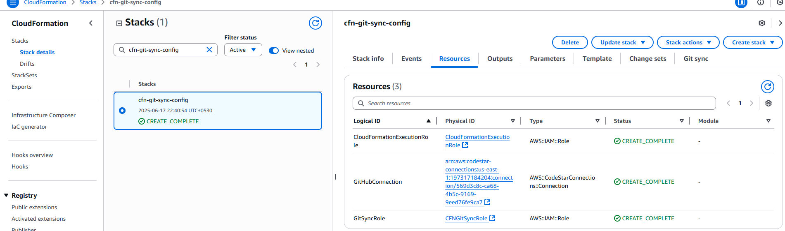

### Step 2: Authorize GitHub and Enable the Connection
Once the connection is created, go back to the Connections tab in the AWS console and authorize GitHub access.

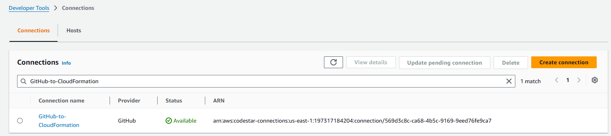

At times, if you had previously linked your repository to your AWS account using a CodeStar connection, deleting and recreating the connection might still cause issues when creating a new CloudFormation stack—AWS may continue referencing the "old" connection. To resolve this, you should unlink the repository using the AWS CLI and then link it again to refresh the connection. Make sure to authorize again via the console after creating a new connection.

List connection
```sh
aws codestar-connections list-repository-links
```
Delete repository link
```sh
aws codestar-connections delete-repository-link --repository-link-id ac01d54c-dcc7-4b4e-97bf-f70592f1377d
```

### Step 3: Create CloudFormation Stacks which use GitSync for different environments

First we will create stack for development environment to use sync from git option

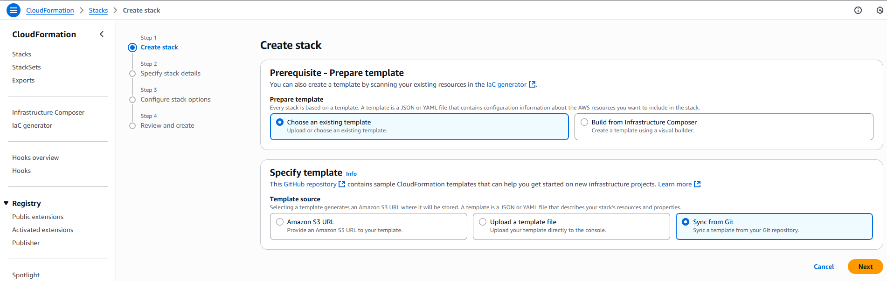

Provide stack name and provide a git repository

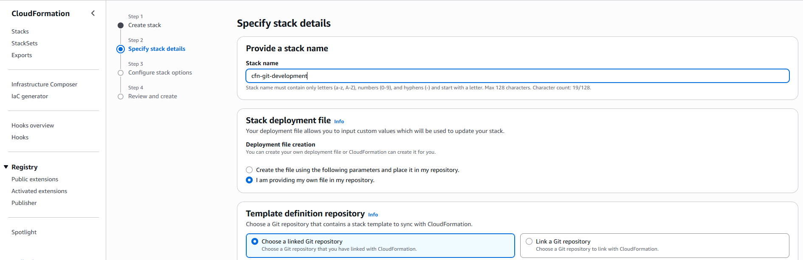

Chose link a git repository option for first time stack creation, fill other fields and choose role CFNGitSyncRole we created earlier

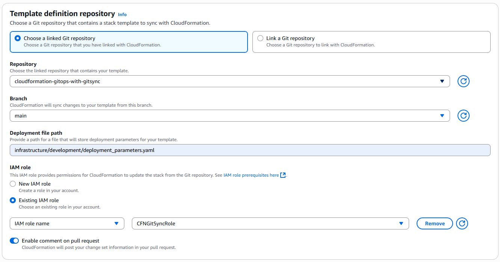

On next page choose CloudFormatinExecutionRole which will be used to created services mentioned in the stack template

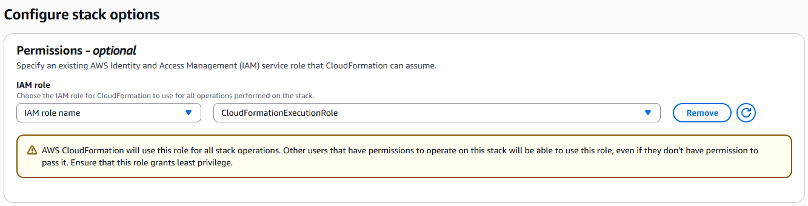

Stack creation is initiated and it uses gitsync

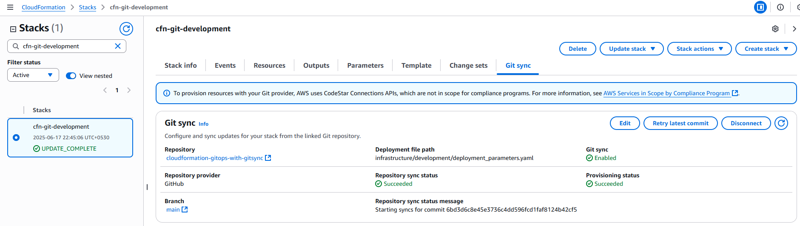

Stack Deployment complete for Development Stage

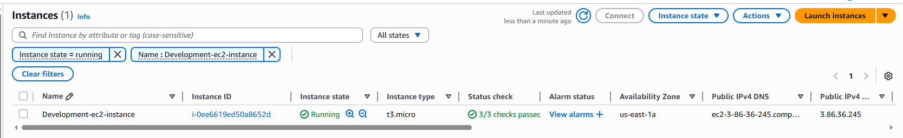

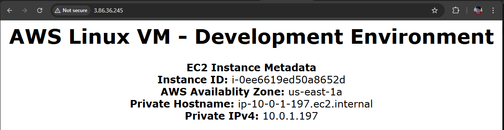

Similary deploy staging and production stacks

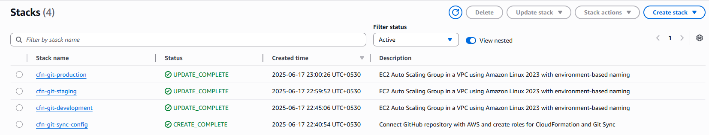

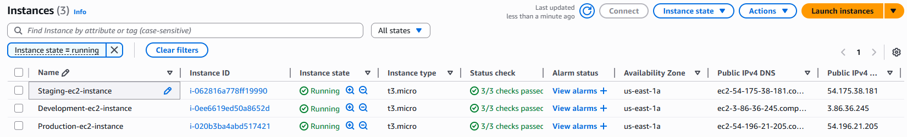

### Step 4: Update the git repo to see gitsync updating the cloudformation stacks

Lets update the desired capacity of autoscaling group to 2 for development environment

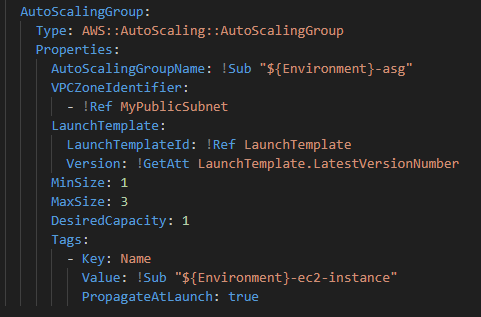

to


